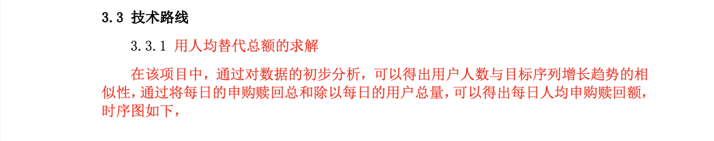
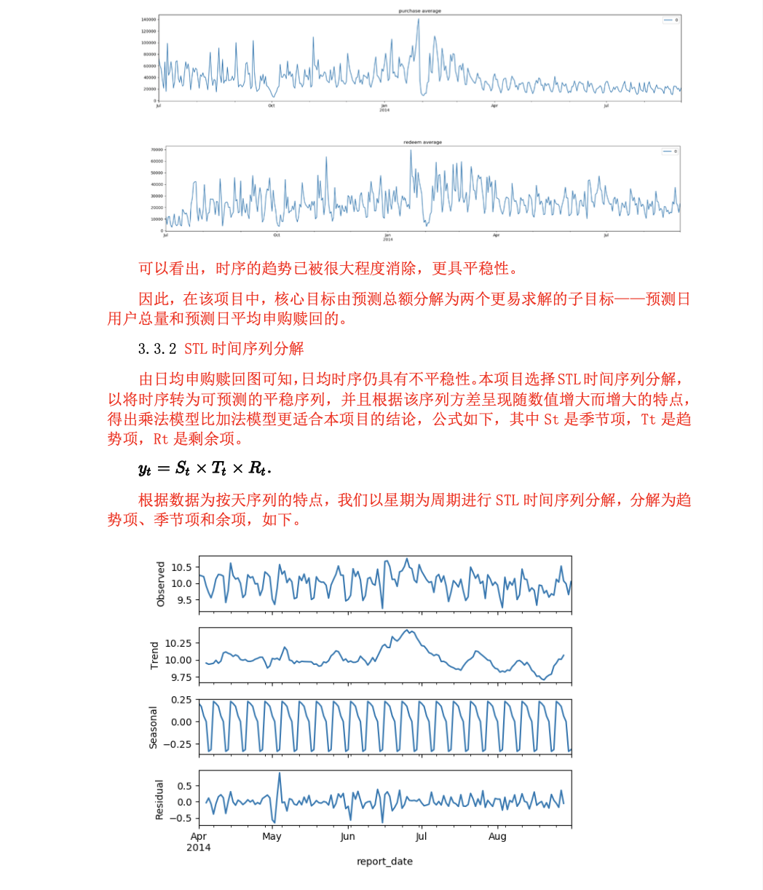
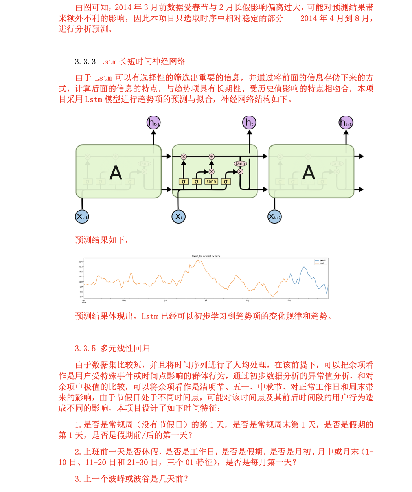
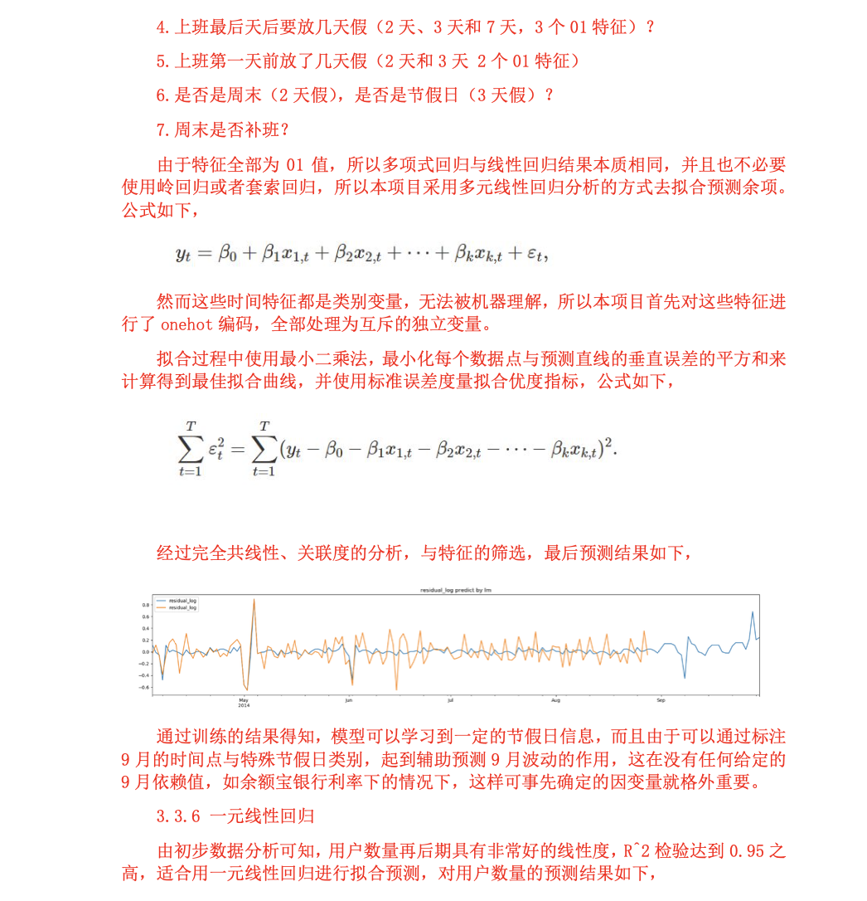
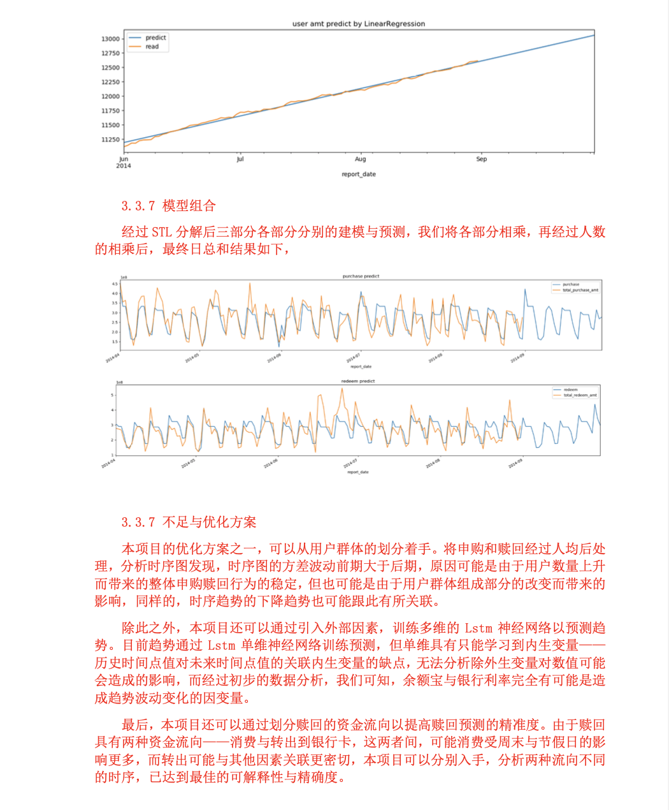

# Funds-Predict
- Top 5-10/140 服务外包2019-资金预测
- 详细文档见 [REPORT.pdf](REPORT.pdf)
## Enveriment
- IDEA
- Python 3.6
## Content
- ARIMA: Auto Regressive Integrated Moving Average
- LSTM: Long Short-Term Memory
- STL: Seasonal Decomposition of Time Series by Loess
- LM: Multivariate Regression

## Model

